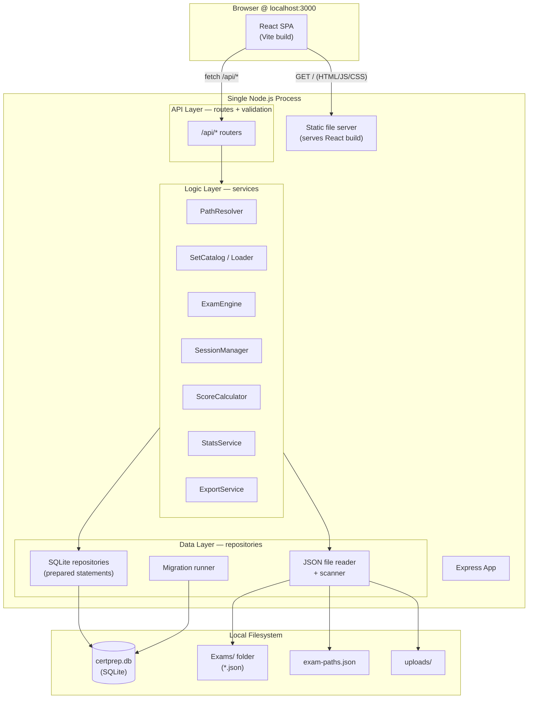
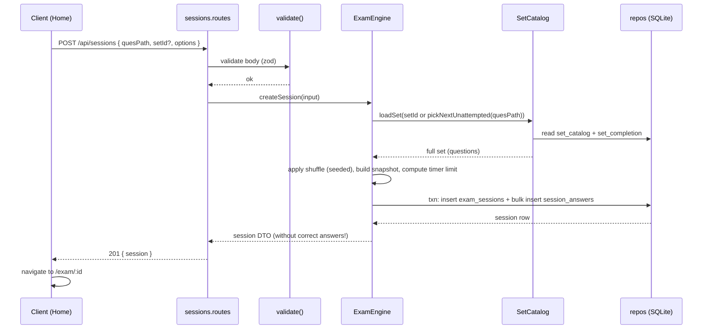
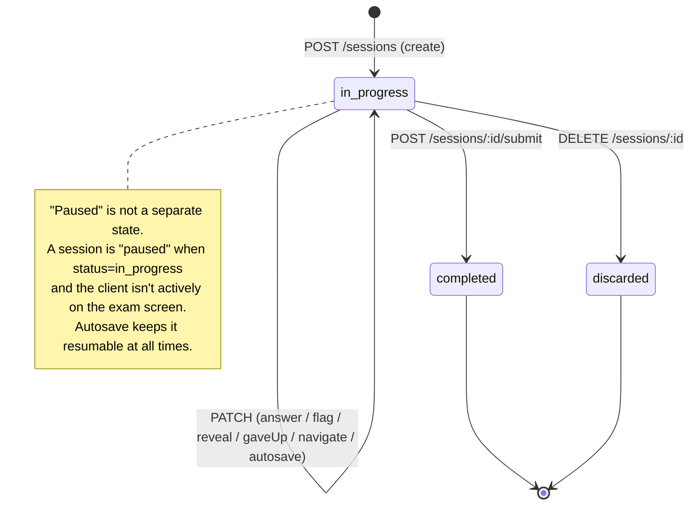

# CertPrep — Architecture

> Read this before writing any code. It defines the runtime model, the layers, the project layout, and the cross-cutting decisions every feature depends on.
>
> ⚠️ **Refined for Next.js.** The **runtime/plumbing** in §2 and the **project layout** in §6 are superseded by [`09-nextjs-refinement.md`](09-nextjs-refinement.md) (single Next.js App Router app; Route Handlers; `better-sqlite3` in the Node runtime). The **layer model (§3–4), snapshotting (§8), the state machine (§9), and the cross-cutting concerns (§10) are unchanged.** Where this doc says "Express"/"Vite", read "Next.js Route Handlers"/"Next App Router."

---

## 1. Architectural Overview

CertPrep is a **single-process, local web application**: one **Next.js** process (App Router) renders the React screens **and** exposes a JSON API via Route Handlers (`src/app/api/**/route.ts`). State lives in one SQLite file (`better-sqlite3`, Node runtime) and in the `Exams/` folder on the local filesystem. No external services, no auth, no network egress. (The diagram below shows the original Express framing; in Next.js the "Express App + Static file server" box becomes "Next.js server: Route Handlers + RSC/Client render" — the API/Logic/Data layers underneath are identical. See [`09` §3](09-nextjs-refinement.md).)



---

## 2. Runtime & Deployment Model

> **Superseded by [`09` §1, §5, §9](09-nextjs-refinement.md).** Summary below; `09` is authoritative.

### 2.1 Production / normal use (`npm start` → `next start`)
- One **Next.js** process binds **`127.0.0.1:3000`** (localhost only — never `0.0.0.0`).
- Next renders RSC/Client screens for all non-`/api` routes and handles `/api/*` via Route Handlers — **one server, one port, no proxy, no separate static server.**
- `better-sqlite3` opens `data/certprep.db` synchronously, in the Node.js server runtime (`serverExternalPackages: ['better-sqlite3']`).
- Migrations run on boot via `instrumentation.ts`'s `register()` **before** requests are served (plus a lazy `getDb()` guard as a backstop).

### 2.2 Development (`npm run dev` → `next dev`)
- A single `next dev` process on **`:3000`** with HMR serves both screens and API. Developers and end users both use `localhost:3000`; **the API base URL (`/api`) is identical in dev and prod**, so client code never branches on environment.
- No second process, no Vite, no proxy.

### 2.3 Why this model
- **Synchronous SQLite (`better-sqlite3`)** removes async/await ceremony around the DB and is more than fast enough for a single local user. Service code reads like straight-line logic.
- **One Next.js process** keeps ops trivial: nothing to orchestrate, no second daemon, no proxy, no container.
- **Next serving screens + API on one port** delivers the plan's promise of "just `npm start`" at `localhost:3000` — now with fewer moving parts than the original Express + Vite split.

---

## 3. The Four Layers

The plan specifies four layers (UI, Logic, Data, Platform). We refine the server side into **API → Logic → Data** so responsibilities stay testable.

| Layer | Responsibility | Must NOT |
|---|---|---|
| **Presentation** (React) | Render screens, capture input, manage ephemeral UI state, call the API. | Contain business rules (scoring, shuffle, completion logic). |
| **API** (Express routers + validators) | HTTP concerns: routing, request/response shaping, validation, status codes, error mapping. | Touch SQLite directly or read files directly. |
| **Logic** (services) | All business rules: path resolution, catalogue building, session lifecycle, scoring, stats, export. | Know about HTTP (`req`/`res`) or SQL strings. |
| **Data** (repositories + file reader + migrations) | Persist/fetch: prepared SQLite statements, JSON file IO, schema migrations. | Contain business rules. |

**Dependency rule:** dependencies point downward only. `Presentation → API → Logic → Data`. The Logic layer is the only place business rules live, and it is unit-testable without HTTP or a browser.

---

## 4. Server Logic Layer — Services

Each service is a plain module exporting functions; it receives repositories/readers via a small composition root (`server/container.ts`) so it can be tested with fakes.

| Service | Owns | Key collaborators |
|---|---|---|
| **PathResolver** | Parse & validate `exam-paths.json`; resolve a `quesPath` to an absolute folder under the sandbox; expose the tree to the UI. | FS reader |
| **SetCatalog / Loader** | Scan `Exams/` (and `uploads/`), parse + validate each JSON set, compute content hashes, maintain the `set_catalog` table, load a full set on demand, pick the next unattempted set for a path. | FS reader, `set_catalog` repo, `set_completion` repo |
| **ExamEngine** | Create a session: choose/shuffle questions, snapshot them, persist the session + blank answer rows; deliver session state; apply answer/flag/reveal/navigation updates. | SetCatalog, session/answer repos, ScoreCalculator |
| **SessionManager** | Pause/resume/discard lifecycle; autosave; list in-progress sessions; ensure a session can be reconstructed exactly after a crash. | session/answer repos |
| **ScoreCalculator** | Pure functions: grade a snapshot+answers into correct/incorrect/revealed/unanswered, %, and per-question correctness (single & multi). | (none — pure) |
| **StatsService** | Aggregate history into totals, averages, best, streak; per-path completion progress. | session repo, set_completion repo |
| **ExportService** | Serialise history to JSON and CSV; full-state export/import. | session/answer repos |

> **ScoreCalculator is pure** (no IO). This is deliberate: scoring is the most logic-dense, edge-case-prone part of the app (multi-select partials, revealed-vs-wrong, unanswered), so it must be trivially unit-testable.

---

## 5. Data Layer

### 5.1 SQLite via repositories
- One repository module per aggregate (`settingsRepo`, `setCatalogRepo`, `sessionRepo`, `answerRepo`, `completionRepo`, `notesRepo`).
- Each repo prepares its statements once at construction (better-sqlite3 prepared statements are cached and fast).
- Repos expose intention-revealing methods (`sessionRepo.insert`, `sessionRepo.listInProgress`, `answerRepo.upsert`) — **no SQL leaks above this layer.**
- Multi-statement operations (create session + bulk insert answers) run inside a **transaction** (`db.transaction(fn)`).

See the full schema in [`02-data-model.md`](02-data-model.md).

### 5.2 JSON file reader & scanner
- Recursively walks the configured Exams root for `*.json`.
- For each file: read → `JSON.parse` (guarded) → schema-validate → hash → upsert into `set_catalog`.
- **One bad file never breaks the scan**: parse/validation errors are collected and returned as a per-file diagnostics list (surfaced in Settings).

### 5.3 Migration runner
- Plain numbered SQL files in `server/db/migrations/` (`0001_init.sql`, `0002_*.sql`, …).
- A `schema_migrations(version, applied_at)` table records applied versions.
- On boot, apply any unapplied migrations in order inside a transaction. Forward-only (no down-migrations needed for a local single-user app; document a manual restore-from-backup path instead).

---

## 6. Project Structure

> ⚠️ **Superseded by [`09` §4](09-nextjs-refinement.md)** — the authoritative layout is the single-package Next.js `src/` tree (`src/app` for Presentation+API, `src/server` for Logic+Data, `src/domain` for schemas/types). The two-package `client/`+`server/` sketch below is retained only to show the *layer* responsibilities, which are unchanged; read `client/src/*` as `src/*` and `server/src/*` as `src/server/*`.

A two-package layout (`client/`, `server/`) under a root that also holds the existing data. Root scripts orchestrate both.

```
exam-engine/
├── package.json                 # root: scripts (dev, start, build, test), workspaces
├── exam-paths.json              # EXISTING — domain tree (source of truth for navigation)
├── Exams/                       # EXISTING — question JSON sets
│   └── Cloud/AWS/...
├── data/                        # gitignored — runtime state
│   ├── certprep.db
│   └── uploads/
├── docs/                        # these planning docs
│
├── server/
│   ├── src/
│   │   ├── index.ts             # entrypoint: run migrations, build app, listen on 127.0.0.1:3000
│   │   ├── app.ts               # express app assembly (middleware, routers, static, errors)
│   │   ├── container.ts         # composition root: wires repos → services
│   │   ├── config.ts            # env + defaults (PORT, DB_PATH, EXAMS_ROOT)
│   │   ├── api/
│   │   │   ├── examPaths.routes.ts
│   │   │   ├── sets.routes.ts
│   │   │   ├── sessions.routes.ts
│   │   │   ├── history.routes.ts
│   │   │   ├── settings.routes.ts
│   │   │   ├── stats.routes.ts
│   │   │   └── middleware/       # validate(), errorHandler(), notFound()
│   │   ├── services/
│   │   │   ├── pathResolver.ts
│   │   │   ├── setCatalog.ts
│   │   │   ├── examEngine.ts
│   │   │   ├── sessionManager.ts
│   │   │   ├── scoreCalculator.ts
│   │   │   ├── statsService.ts
│   │   │   └── exportService.ts
│   │   ├── data/
│   │   │   ├── db.ts             # opens better-sqlite3, exposes singleton
│   │   │   ├── migrate.ts        # migration runner
│   │   │   ├── migrations/       # 0001_init.sql, ...
│   │   │   ├── fileReader.ts     # scan + read + hash JSON sets
│   │   │   └── repos/            # settingsRepo.ts, sessionRepo.ts, ...
│   │   └── domain/
│   │       ├── schemas.ts        # zod schemas: question set, exam-paths, API payloads
│   │       └── types.ts          # shared TS types (also imported by client via shared/)
│   └── tsconfig.json
│
├── client/
│   ├── index.html
│   ├── vite.config.ts           # /api proxy → :3000
│   ├── tailwind.config.ts
│   ├── src/
│   │   ├── main.tsx
│   │   ├── App.tsx              # router + layout shell
│   │   ├── routes/             # Home, Exam, Results, History, Settings, Resume
│   │   ├── features/           # mirrors F1–F8: components grouped by feature
│   │   ├── components/         # shared UI (Button, Dropdown, ProgressBar, ...)
│   │   ├── lib/                # apiClient, queryKeys, formatters
│   │   ├── hooks/              # useExamSession, useTimer, useKeyboardShortcuts
│   │   ├── store/              # exam reducer / zustand store (ephemeral exam state)
│   │   └── styles/             # tailwind entry, design tokens
│   └── tsconfig.json
│
└── shared/                      # types shared by client & server (optional)
    └── types.ts
```

> **TypeScript throughout.** The plan's stack (React/Vite/Express/better-sqlite3/Tailwind) is TS-friendly, and a typed contract between client and server (shared `types.ts` + zod schemas) eliminates a whole class of integration bugs in an API-driven app.

---

## 7. Request Lifecycle (worked example: "Start exam")



**Key point:** the session DTO sent to the client during an exam **omits `correctAnswer` and explanations** for unrevealed questions, so answers can't be scraped from network traffic. Correct data is attached only when a question is revealed/submitted. (Local app, so this is hygiene rather than hard security — but it keeps the contract honest and makes the "give up to reveal" semantics real.)

---

## 8. Critical Decision: Question Snapshotting

**Problem:** JSON sets are editable files. If a set is edited or deleted while an exam is in progress — or after it's completed — naive "reference by setId" would corrupt the in-progress exam and make history detail views lie.

**Decision:** At session creation, **snapshot the exact questions as presented** (including shuffle order and, later, shuffled option order) into `exam_sessions.question_snapshot` (a JSON column). All gameplay, grading, and history detail read from the snapshot, never from the live file.

**Consequences:**
- ✅ In-progress exams are immune to file edits/deletes.
- ✅ History detail always shows exactly what was taken, even years later, even if the file is gone.
- ✅ Retake-incorrects can reconstruct the subset from the original snapshot.
- ⚠️ DB grows with history (acceptable: a 35-question set snapshot is a few KB; thousands of exams ≈ low tens of MB).
- ⚠️ "Set was updated" is intentionally invisible to past sessions. The `set_catalog.content_hash` lets us *detect* drift and inform the user, without mutating history.

This is the single most important data-integrity decision in the app. See schema details in [`02-data-model.md` §3](02-data-model.md).

---

## 9. Exam Session State Machine

A session is the unit of history and the thing that gets paused/resumed. Its lifecycle:



- **In-progress = resumable.** There is no distinct "paused" status; pausing is just "stop sending updates." Because every change is autosaved, an in-progress session is *always* resumable — even after a crash or refresh. The "Paused exams" list (F6) is simply `status = 'in_progress'`.
- **Completed** sessions become history (F7) and trigger a `set_completion` insert (F3 repeat-avoidance).
- **Discarded** sessions are soft-handled: row deleted (or marked) and answers cascade-deleted; they never appear in history.

#### 9.1 Per-question state machine (post-ADR-14)

Each `session_answers` row carries four raw state fields — `selected_options`, `is_flagged`, `is_revealed`, **`is_gave_up`** (post-ADR-14) — and derives a single **7-state `NavStatus`** for the live palette on the client:

```
NavStatus (priority order):
  1. current            ←  i === s.currentIndex
  2. gave_up            ←  a.gaveUp === true        (user intent; sticky / monotonic)
  3. answered_correct   ←  a.revealed && setEquals(selected, correctAnswer)
  4. answered_incorrect ←  a.revealed && !setEquals(selected, correctAnswer)
  5. answered_pending   ←  a.revealed && (no selection OR correctAnswer not yet known)
  6. flagged            ←  a.flagged
  7. unanswered         ←  default
```

- `gaveUp` is captured at the moment of reveal (not derived from `selected`) — a user may pick options and then change their mind. The PATCH body folds `{ revealed: true, gaveUp: true }` into a single atomic write so the server never sees a gave-up question without a corresponding reveal.
- The post-reveal `answered_correct` / `answered_incorrect` split is computed client-side from the snapshot's `correctAnswer` (which the server only attaches to revealed questions) and the user's `selected` set. This mirrors the server's `ScoreCalculator.setEquals` exactly.
- The server's `ScoreCalculator` independently classifies the question as `outcome = "gave_up"` (priority 1) → `"revealed"` → `"unanswered"` → `"correct"` / `"incorrect"`, and writes the tally into `exam_sessions.{gave_up_count, revealed_count, …}`.

---

## 10. Cross-Cutting Concerns

### 10.1 Configuration
- `server/src/config.ts` reads env with defaults: `PORT=3000`, `DB_PATH=./data/certprep.db`, `EXAMS_ROOT=./Exams`, `EXAM_PATHS_FILE=./exam-paths.json`.
- **User-overridable settings** (Exams root, timer defaults, shuffle, theme) live in the `settings` table and take precedence over env defaults at runtime. Env is the floor; the DB is the override.

### 10.2 Error handling
- **Server:** services throw typed `AppError(code, message, httpStatus, details?)`. A single Express error middleware maps them to a consistent JSON envelope:
  ```json
  { "error": { "code": "SET_NOT_FOUND", "message": "...", "details": {} } }
  ```
  Unexpected errors → `500 INTERNAL` with the message logged but not leaked verbatim.
- **Client:** a typed `apiClient` throws `ApiError`; React Query surfaces it; a global error boundary + toast system shows it. The exam screen degrades gracefully (autosave failure shows a non-blocking "couldn't save" indicator and retries).

### 10.3 Validation
- **Inbound JSON sets:** validated with zod on scan; failures collected, not thrown.
- **API payloads:** validated with zod in `validate()` middleware before reaching services.
- Shared zod schemas in `server/src/domain/schemas.ts` are the single definition; TS types are inferred from them.

### 10.4 Logging
- Minimal structured logging to stdout (a tiny logger, or `pino`). Request log line + error log line. No external sinks. Verbosity via `LOG_LEVEL`.

### 10.5 Security (local-but-careful)
- Bind to **`127.0.0.1` only.**
- **Path traversal guard:** every resolved path (quesPath, uploaded file target, Exams root) must `path.resolve` to *within* the sandbox root; reject otherwise. No raw user path is ever `fs`-opened.
- **Uploads:** restrict to `.json`, cap size, parse+validate before persisting, store under `data/uploads/`.
- No `eval`, no dynamic `require` of question content. Questions are data, never code.
- CORS: not needed in prod (same origin); in dev the Vite proxy makes it same-origin too. Lock CORS off by default.

### 10.6 Data portability & backup
- Everything is `data/certprep.db` + `Exams/` + `exam-paths.json`. Copy those three and you have a complete backup.
- Settings → "Export history (JSON/CSV)" and a full-state export complement the file-copy path.

### 10.7 Performance
- Prepared statements + indexes on `exam_sessions(status)`, `exam_sessions(completed_at)`, `exam_sessions(ques_path)`, `session_answers(session_id)`.
- Catalogue scan is on-demand + on-boot, not on every request; results cached in `set_catalog`.
- Question sets loaded lazily (only when an exam starts).
- React Query caches server reads; the exam screen holds session state locally and syncs via debounced autosave to avoid a request per keystroke.

---

## 11. Non-Functional Requirements

| Attribute | Target |
|---|---|
| **Offline** | 100% functional with no network after `npm install`. |
| **Startup** | App usable within ~1–2s of `npm start` on a typical laptop (migrations + boot). |
| **Catalogue scan** | Hundreds of sets scanned in well under a second; thousands within a couple of seconds. |
| **Exam responsiveness** | Question navigation and answer selection feel instant (local state; no network round-trip on the hot path). |
| **Durability** | No data loss on browser refresh or process restart mid-exam (autosave + snapshot). |
| **Portability** | State survives copying `data/` + `Exams/` to another machine with the same Node major version. |
| **Footprint** | Single process; idle memory modest; DB grows ~KBs per completed exam. |

---

## 12. Architecture Decision Records (summary)

| # | Decision | Why | Trade-off accepted |
|---|---|---|---|
| ADR-1 | Single Express process serves API **and** static SPA on `:3000` | Matches "just `npm start` at localhost:3000"; trivial ops | Dev needs a Vite proxy for HMR |
| ADR-2 | `better-sqlite3` (synchronous) | Simplest correct code for single-user local; fast | Not suited to concurrent multi-user (a non-goal) |
| ADR-3 | TypeScript end-to-end + shared zod schemas | Typed client/server contract; fewer integration bugs | Build step + types upkeep |
| ADR-4 | **Snapshot questions into the session** | Integrity of in-progress exams & history under file edits | Larger DB |
| ADR-5 | No separate "paused" status; in_progress = resumable via autosave | One source of truth; crash-resilient by construction | Must autosave reliably |
| ADR-6 | Forward-only numbered SQL migrations | Simple, transparent, reviewable | No automated down-migrations (mitigated by file-copy backups) |
| ADR-7 | Server state via React Query; ephemeral exam state via a local reducer/store | Right tool per data kind; avoids over-fetching on the exam hot path | Two state mechanisms to understand |
| ADR-8 | `questionType` field, default `'single'` | Backward-compatible path to multi/ordered/freetext | Engine must branch by type as types are added |
| ADR-9 | **Single Next.js (App Router) app replaces Express + Vite**; REST contract kept as Route Handlers | One process, one port, no proxy; preserves the mature API/DB contracts + React Query/Zustand client | Next-specific gotchas (`09` §5); must respect the server/client boundary |
| ADR-10 | **`better-sqlite3` in Next Node runtime** (`serverExternalPackages` + `globalThis` singleton + `instrumentation.ts` boot) | Synchronous, fast, simplest correct code for one local user; survives HMR | Native build per platform (Node 22 pinned); never edge |
| ADR-11 | **Timer = client tick + absolute-`elapsedMs` autosave, server-clamped (replace semantics)** | Idempotent autosave; instant UI | Trusts a clamped client value; ~400 ms crash window |
| ADR-12 | **`instrumentation.register()` runs migrations + boot scan** + lazy `getDb()` guard | Next-idiomatic single boot hook; idempotent, test-safe | Must guard to `NEXT_RUNTIME==='nodejs'` |
| ADR-13 | **Unified array shape for `correctAnswer`** (always `string[]`) + checkbox-group UI for BOTH `single` and `multi` (user is never told which is which) + set-equality grader on a normalised array | Removes the polymorphic-shape pain across schema, mapper, display, grader; makes `multi` in-MVP; trains choice elimination (pedagogical) | Historical `exam_sessions.question_snapshot` rows still hold strings; the grader normalises both shapes. Picking 2+ options on a `single` question scores `incorrect` (intentional — the user is not prevented from over-selecting). Display components keep a defensive `Array.isArray` branch (cheap) until snapshots age out. |
| ADR-14 | **`gave_up` is a first-class outcome** — distinct from `revealed` — captured as a new `session_answers.is_gave_up` column + monotonic client field + 5-way results breakdown + dedicated filter tab + retake-pool inclusion | Users can see "I gave up" isolated from "I submitted for review"; the live palette can collapse gave-up questions into a distinct `gave_up` swatch instead of conflating them with `revealed`; the navigator gains a `correct`/`incorrect` split post-reveal | New DB column (`is_gave_up`) + new score field (`gave_up_count`) + new `Outcome` enum value; client derives the post-reveal correct/incorrect split from the snapshot's `correctAnswer` (only attached to revealed questions, so the split is safe by construction) |
| ADR-15 | **Display order is fixed A, B, C, D** — the chip letter on screen is always the canonical A/B/C/D label, regardless of whether options are shuffled server-side. The underlying option key (the one stored in `selected_options` and used for grading) is mapped to the display position via the per-session `optionOrder`. The history/review surface mirrors the live exam view: same shuffled order, same chip labels, and `correctAnswer` / `yourAnswer` are reverse-mapped from underlying key to display letter so "Correct answer: A" matches the chip the user actually clicked. | Stable, predictable UI: regardless of how the question set is shuffled, "A" is always the first option on screen. The review screen is a faithful mirror of the live exam — the user sees the same options in the same order, and the summary uses the same letters they clicked. Explanations never lose alignment with the chip letter they describe. | The session snapshot's `optionOrder` is computed and persisted, AND the results mapper surfaces it on the `ResultsQuestion` DTO so the review component can render the same order + reverse-map. Storage layer (`selected_options`, `correctAnswer`, `explanations`) is unchanged — the underlying keys remain the source of truth. |

ADR-9–12 are detailed in [`09-nextjs-refinement.md`](09-nextjs-refinement.md). These mirror and extend the recommendations in the product plan; revisit them in [`05-feature-roadmap.md`](05-feature-roadmap.md) when sequencing.

---

## 13. What the Frontend & API specs add

This doc defines the skeleton. Two companion docs flesh out the contracts the layers expose:
- The **HTTP contract** (every endpoint, payload, status code): [`03-api-specification.md`](03-api-specification.md).
- The **client shape** (routing, state, components, design tokens): [`04-frontend-architecture.md`](04-frontend-architecture.md).
- The **persistence shape** (tables, columns, indexes, JSON contracts): [`02-data-model.md`](02-data-model.md).
