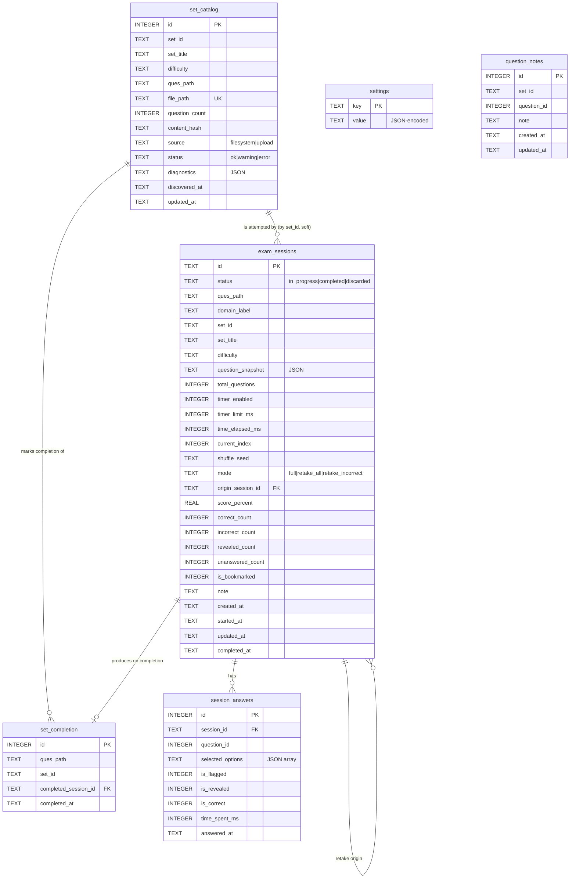
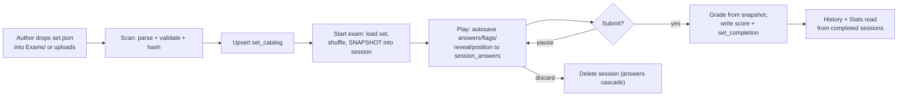

# CertPrep — Data Model

> Defines the SQLite schema, the JSON contracts (question sets + `exam-paths.json`), and how data flows and persists. Cross-referenced by [`01-architecture.md`](01-architecture.md) and [`03-api-specification.md`](03-api-specification.md).

There are **two kinds of data**:

1. **Authored content** — `exam-paths.json` (navigation tree) and the `Exams/**/*.json` question sets. Hand-written, version-controlled, the source of truth for *what can be studied*. CertPrep only ever **reads** these.
2. **Runtime state** — everything CertPrep generates: the catalogue index, sessions, answers, completion progress, notes, bookmarks, settings. Lives in **SQLite** (`data/certprep.db`).

---

## 1. JSON Contract — Question Set

The existing format (unchanged, kept fully compatible):

```jsonc
{
  "setId": "e8236c46-9743-466f-9019-48e40707d22d",  // UUID, identifies the set
  "setTitle": "AWS SAA Practice - IAM & EC2 Easy Set 1",
  "difficulty": "Easy",                              // Easy | Medium | Hard | Mock
  "questions": [
    {
      "id": 1,                                       // integer, unique within the set
      "questionText": "What does IAM stand for in AWS?",
      "options": { "A": "...", "B": "...", "C": "...", "D": "..." },
      "correctAnswer": ["B"],                       // ALWAYS a string[] — length 1 for single, ≥ 1 for multi (ADR-13)
      "explanations": {
        "A": { "description": "short label", "reason": "why right/wrong" },
        "B": { "description": "...",         "reason": "..." },
        "C": { "...": "..." },
        "D": { "...": "..." }
      },
      "Tips": "mnemonic / study tip"
    }
  ]
}
```

### 1.1 Additive extension — `questionType` (from plan §2.2)

Backward-compatible. **Absent ⇒ `"single"`.** No existing file changes.

```jsonc
{
  "questionType": "single",   // default — one correct option (still rendered as a checkbox group, length-1 answer)
  // "questionType": "multi",     // select all that apply — length ≥ 1 answer
  // "questionType": "ordered",   // arrange steps (still catalogue-only)
  // "questionType": "freetext"   // open-ended, self-graded (still catalogue-only)
}
```

| `questionType` | `correctAnswer` shape | Grading | Horizon |
|---|---|---|---|
| `single` (default) | `["B"]` (length 1) | set equality | **MVP** |
| `multi` | `["A","C"]` (length ≥ 1) | set equality (strict, no partial credit) | **MVP (post ADR-13)** |
| `ordered` | `["B","A","C"]` (correct order) | sequence match | Long-term (still catalogue-only) |
| `freetext` | `null` / model answer string | self-graded after reveal | Long-term (still catalogue-only) |

> **MVP validation accepts `single` and `multi`.** `ordered` and `freetext` are
> catalogued but flagged "unsupported type — engine pending". The UI renders
> BOTH `single` and `multi` questions as checkbox groups — the user is never
> told which is which (pedagogical: trains choice elimination; see ADR-13).
> Selecting extra options on a `single` question scores `incorrect` (set
> equality fails on length mismatch).

### 1.2 Question set — validation rules (zod)

A file is **valid** iff:
- `setId` is a non-empty string (UUID recommended, not enforced).
- `setTitle` non-empty string; `difficulty` ∈ {Easy, Medium, Hard, Mock} (case-insensitive, normalised).
- `questions` is a non-empty array; each question:
  - `id` integer, **unique within the set**.
  - `questionText` non-empty string.
  - `options` object with **≥2** keys; keys are single uppercase letters (A, B, C, D, …) — not hardcoded to exactly four, to allow 2–6 options.
  - `correctAnswer` (ADR-13 — unified array shape):
    - **Always a `string[]`** of option keys (length 1 for `single`, length ≥ 1 for `multi`).
    - The schema still accepts a legacy `string` shape (length 1 only) as a
      backward-compat shim for historical `Exams/*.json` files and
      `exam_sessions.question_snapshot` rows written before the migration.
      The grader normalises both shapes at grade time.
    - All elements must be distinct and present in the `options` keys.
  - `explanations`: object keyed by the **same keys as `options`**; each `{ description, reason }` (both strings). Missing explanation keys are a **warning**, not a hard failure (engine shows a fallback).
  - `Tips`: optional string.

Validation is **layered**: hard errors exclude a file from the catalogue (with a reason surfaced in Settings); warnings catalogue the file but annotate it.

> **Note on key casing:** the existing field is `"Tips"` (capital T). The schema preserves the existing casing exactly to stay compatible with current files; the loader reads `Tips`.

### 1.3 File naming convention (unchanged, from README)
`{provider}_{exam-code}_{topic}_{set-number}_{difficulty}.json`, e.g. `aws_saa_iam_ec2_set1_easy.json`. Mock sets omit difficulty: `aws_saa_exam_style_set1.json`. Naming is **advisory** — the catalogue keys on file path + parsed `setId`, not the filename.

---

## 2. JSON Contract — `exam-paths.json` (navigation tree)

Drives the cascading dropdowns with **zero code changes** to add domains. Recursive structure:

```jsonc
{
  "label": "Choose a domain for exam",   // prompt for THIS dropdown level
  "cloud": {                             // arbitrary key (machine id)
    "title": "Cloud Certificate Exams",  // option text shown at the PARENT level
    "label": "Choose the cloud provider",// prompt for the NEXT level
    "aws": {
      "title": "Amazon Web Services (AWS)",
      "label": "Choose a certification",
      "saa": {
        "title": "AWS Solutions Architect Associate",
        "label": "Choose difficulty level",
        "easy": { "title": "Easy",      "quesPath": "Exams/Cloud/AWS/Solutions-Architect-Associate/Easy" },
        "medium": { "title": "Medium",  "quesPath": "Exams/Cloud/AWS/Solutions-Architect-Associate/Medium" },
        "hard": { "title": "Hard",      "quesPath": "Exams/Cloud/AWS/Solutions-Architect-Associate/Hard" },
        "mock": { "title": "Mock Exam", "quesPath": "Exams/Cloud/AWS/Solutions-Architect-Associate/Mock" }
      }
    }
  }
}
```

### 2.1 Node grammar
- **Reserved keys** at any node: `label` (string — prompt for choosing among this node's children), `title` (string — how this node appears as an option in its parent's dropdown), `quesPath` (string — **leaf only**, relative path to a folder of sets), and optionally `icon` (string — domain icon id, plan §5).
- **Every other key** is a child node (machine id → child object).
- A node is a **leaf** iff it has `quesPath` (and therefore no further child nodes). A leaf is where "Start exam" becomes available.
- **Arbitrary depth**: the tree may be 2 levels or 7; the selector renders one dropdown per level until a leaf is reached.

### 2.2 Validation rules
- Root must have `label` and ≥1 child.
- Every non-leaf node must have `label`, `title` (except the root, whose `title` is implicit), and ≥1 child.
- Every leaf must have `title` and a `quesPath` that resolves (after sandboxing) to an existing directory under the Exams root.
- `quesPath` values are validated by **PathResolver**; a dangling `quesPath` is a warning (shown in Settings), not a crash.

### 2.3 Optional enhancement — `icon` (plan §5 "Domain icons")
```jsonc
"cloud": { "title": "Cloud Certificate Exams", "icon": "cloud", "label": "...", ... }
```
`icon` is an opaque string mapped client-side to an icon component. Absent ⇒ a default icon. Purely cosmetic; never affects navigation.

---

## 3. SQLite Schema

> **Refined — see [`09` §7.6](09-nextjs-refinement.md).** The schema itself is unchanged; `0001_init.sql` additionally gets **CHECK constraints on every enum column**, a **composite index** `set_completion(ques_path, set_id)`, and WAL/integrity boot pragmas. Critically, **`PRAGMA foreign_keys = ON` is per-connection in better-sqlite3** and is applied inside `getDb()` on every open (incl. test DBs) — see §3.1.1. These are written into the migration; the §3.1 DDL below shows the base tables.

`better-sqlite3`, one file `data/certprep.db`. SQLite stores JSON as `TEXT`; booleans as `INTEGER` (0/1); timestamps as ISO-8601 `TEXT` (UTC). All tables created by migration `0001_init.sql`.



### 3.1 DDL (`0001_init.sql` — MVP tables)

```sql
PRAGMA journal_mode = WAL;        -- better write concurrency & crash safety
PRAGMA foreign_keys = ON;

CREATE TABLE schema_migrations (
  version    INTEGER PRIMARY KEY,
  applied_at TEXT NOT NULL
);

-- Key/value app + user settings. Values are JSON-encoded.
CREATE TABLE settings (
  key   TEXT PRIMARY KEY,
  value TEXT NOT NULL
);

-- Index of every discovered question set (filesystem + uploads).
CREATE TABLE set_catalog (
  id             INTEGER PRIMARY KEY AUTOINCREMENT,
  set_id         TEXT    NOT NULL,
  set_title      TEXT    NOT NULL,
  difficulty     TEXT    NOT NULL,
  ques_path      TEXT    NOT NULL,        -- leaf path from exam-paths.json
  file_path      TEXT    NOT NULL UNIQUE, -- absolute path to the .json file
  question_count INTEGER NOT NULL,
  content_hash   TEXT    NOT NULL,        -- sha256 of file contents
  source         TEXT    NOT NULL DEFAULT 'filesystem', -- filesystem | upload
  status         TEXT    NOT NULL DEFAULT 'ok',          -- ok | warning | error
  diagnostics    TEXT,                    -- JSON array of validation messages
  discovered_at  TEXT    NOT NULL,
  updated_at     TEXT    NOT NULL
);
CREATE INDEX idx_catalog_ques_path ON set_catalog(ques_path);
CREATE INDEX idx_catalog_set_id    ON set_catalog(set_id);

-- Which sets have been completed for a given path (drives repeat-avoidance).
CREATE TABLE set_completion (
  id                   INTEGER PRIMARY KEY AUTOINCREMENT,
  ques_path            TEXT NOT NULL,
  set_id               TEXT NOT NULL,
  completed_session_id TEXT,
  completed_at         TEXT NOT NULL
);
CREATE INDEX idx_completion_path ON set_completion(ques_path);

-- One attempt at a set. The unit of history. Snapshot makes it self-contained.
CREATE TABLE exam_sessions (
  id                TEXT PRIMARY KEY,             -- uuid
  status            TEXT NOT NULL DEFAULT 'in_progress',
  ques_path         TEXT NOT NULL,
  domain_label      TEXT NOT NULL,                -- "Cloud / AWS / SAA / Easy"
  set_id            TEXT NOT NULL,
  set_title         TEXT NOT NULL,
  difficulty        TEXT NOT NULL,
  question_snapshot TEXT NOT NULL,                -- JSON: ordered questions as presented
  total_questions   INTEGER NOT NULL,
  timer_enabled     INTEGER NOT NULL DEFAULT 0,
  timer_limit_ms    INTEGER,                      -- null = untimed
  time_elapsed_ms   INTEGER NOT NULL DEFAULT 0,
  current_index     INTEGER NOT NULL DEFAULT 0,
  shuffle_seed      TEXT,
  mode              TEXT NOT NULL DEFAULT 'full', -- full | retake_all | retake_incorrect
  origin_session_id TEXT,                         -- FK to exam_sessions.id when a retake
  score_percent     REAL,
  correct_count     INTEGER,
  incorrect_count   INTEGER,
  revealed_count    INTEGER,
  unanswered_count  INTEGER,
  is_bookmarked     INTEGER NOT NULL DEFAULT 0,
  note              TEXT,
  created_at        TEXT NOT NULL,
  started_at        TEXT,
  updated_at        TEXT NOT NULL,
  completed_at      TEXT
);
CREATE INDEX idx_sessions_status       ON exam_sessions(status);
CREATE INDEX idx_sessions_ques_path    ON exam_sessions(ques_path);
CREATE INDEX idx_sessions_completed_at ON exam_sessions(completed_at);

-- Per-question state within a session.
CREATE TABLE session_answers (
  id               INTEGER PRIMARY KEY AUTOINCREMENT,
  session_id       TEXT NOT NULL REFERENCES exam_sessions(id) ON DELETE CASCADE,
  question_id      INTEGER NOT NULL,              -- matches question.id in the snapshot
  selected_options TEXT NOT NULL DEFAULT '[]',    -- JSON array (single = one element)
  is_flagged       INTEGER NOT NULL DEFAULT 0,
  is_revealed      INTEGER NOT NULL DEFAULT 0,    -- "gave up"
  is_correct       INTEGER,                       -- null until graded
  time_spent_ms    INTEGER NOT NULL DEFAULT 0,
  answered_at      TEXT,
  UNIQUE(session_id, question_id)
);
CREATE INDEX idx_answers_session ON session_answers(session_id);
```

### 3.1.1 Required refinements to `0001_init.sql` (from [`09` §7.6](09-nextjs-refinement.md))

Apply these *in* `0001_init.sql` — they are cheap and close the highest-risk correctness findings from `08`:

```sql
-- Enum CHECKs (reject typos like 'in-progress' at write time):
--   set_catalog.status     CHECK (status IN ('ok','warning','error'))
--   set_catalog.source     CHECK (source IN ('filesystem','upload'))
--   exam_sessions.status   CHECK (status IN ('in_progress','completed','discarded'))
--   exam_sessions.mode     CHECK (mode IN ('full','retake_all','retake_incorrect'))
--   exam_sessions.difficulty CHECK (difficulty IN ('Easy','Medium','Hard','Mock'))
-- Contradictory-state guard:
--   exam_sessions CHECK (timer_enabled = 0 OR timer_limit_ms IS NOT NULL)
-- Repeat-avoidance composite index (in addition to the single-column one):
CREATE INDEX idx_completion_path_set ON set_completion(ques_path, set_id);
```

**Connection pragmas (NOT in the SQL file — set in `getDb()` on every open):**
`PRAGMA journal_mode = WAL;` and **`PRAGMA foreign_keys = ON;`**. The latter is connection-scoped in better-sqlite3; if it is ever missed, all `ON DELETE CASCADE` silently stops working (manifests only on discard/delete). A repo test deletes a session and asserts its `session_answers` are gone, guarding this. The migration runner wraps each migration in a **transaction** and writes the `schema_migrations` row only on commit. Score fields being NOT NULL when `status='completed'` and `timer_enabled ⇒ timer_limit_ms` are also enforced at the submit/create handlers. Boot runs `PRAGMA integrity_check` with a friendly fatal on corruption.

### 3.2 Forward-designed tables (created when their roadmap feature lands)

These are **not** in `0001_init` but are designed now so the roadmap needs no painful reshaping. Each ships in its own migration.

```sql
-- Medium-term: notes linked to a question (surface on future appearances).
CREATE TABLE question_notes (
  id          INTEGER PRIMARY KEY AUTOINCREMENT,
  set_id      TEXT NOT NULL,
  question_id INTEGER NOT NULL,
  note        TEXT NOT NULL,
  created_at  TEXT NOT NULL,
  updated_at  TEXT NOT NULL,
  UNIQUE(set_id, question_id)
);

-- Medium-term: spaced-repetition performance per question.
CREATE TABLE question_performance (
  id            INTEGER PRIMARY KEY AUTOINCREMENT,
  set_id        TEXT NOT NULL,
  question_id   INTEGER NOT NULL,
  times_seen    INTEGER NOT NULL DEFAULT 0,
  times_correct INTEGER NOT NULL DEFAULT 0,
  ease          REAL,        -- SR ease factor
  due_at        TEXT,        -- next review timestamp
  last_seen_at  TEXT,
  UNIQUE(set_id, question_id)
);

-- Medium-term: tags for cross-set filtering.
CREATE TABLE tags          ( id INTEGER PRIMARY KEY, name TEXT UNIQUE NOT NULL );
CREATE TABLE set_tags      ( set_id TEXT, tag_id INTEGER, PRIMARY KEY(set_id, tag_id) );
```

---

## 4. `settings` keys (canonical list)

| Key | Type (JSON) | Default | Feature |
|---|---|---|---|
| `exams_root` | string | env `EXAMS_ROOT` (`./Exams`) | F3/F8 |
| `source_mode` | `"filesystem" \| "upload"` | `"filesystem"` | F3/F8 |
| `timer_enabled` | boolean | `true` | F4/F8 |
| `timer_default_minutes` | number | `null` (per-set/derived) | F4/F8 |
| `show_count_before_start` | boolean | `true` | F8 |
| `shuffle_questions` | boolean | `false` | F4/F8 |
| `shuffle_options` | boolean | `false` | F4/F8 |
| `progressive_reveal` | boolean | `true` | F4/F5 |
| `theme` | `"system" \| "light" \| "dark"` | `"system"` | F1/F8 |
| `last_selected_path` | string[] (selected keys) | `[]` | F1/F2 |
| `schema_version_seen` | number | `0` | internal |

Stored one row per key, value JSON-encoded. The API exposes them as a single object (see [`03-api-specification.md`](03-api-specification.md)).

---

## 5. The Snapshot Shape

`exam_sessions.question_snapshot` is a JSON array of the questions **as presented**, in presentation order, each carrying everything needed to play and grade — including the data hidden from the client until reveal:

```jsonc
[
  {
    "id": 7,                       // original question id (stable key for answers)
    "order": 1,                    // position in THIS session (post-shuffle)
    "questionType": "single",
    "questionText": "...",
    "options": { "A": "...", "B": "...", "C": "...", "D": "..." },
    "optionOrder": ["C","A","D","B"],   // present iff shuffle_options; else natural order
    "correctAnswer": ["B"],        // stored as array (ADR-13); pre-migration snapshots may hold a string — the grader normalises both
    "explanations": { "A": {...}, "B": {...}, ... },
    "Tips": "..."
  }
]
```

- **Why store `correctAnswer`/`explanations` here too?** So grading and history detail are fully self-contained and immune to file changes (ADR-4). The **API** strips these from the live exam DTO and re-attaches per question only on reveal/submit.
- `session_answers.question_id` references `snapshot[i].id` — the stable original id, not `order` — so retake-incorrects can map cleanly.

---

## 6. Data Lifecycle



### 6.1 Completion & repeat-avoidance (F3)
- On submit, insert a `set_completion(ques_path, set_id, completed_session_id)`.
- "Start exam" for a path asks SetCatalog for a set whose `set_id` is **not** in `set_completion` for that path.
- When all sets for a path are completed, the API returns an "exhausted" signal; the UI prompts to **reset progress for that path** (delete its `set_completion` rows — history is untouched).

### 6.2 Reset semantics (F8)
- **Reset progress (per path):** delete `set_completion` rows for that path. History/sessions remain.
- **Full reset:** truncate `exam_sessions`, `session_answers`, `set_completion`, `question_notes`, … but keep `settings` and `set_catalog` (re-derivable anyway). A separate "factory reset" also clears settings.

### 6.3 Drift detection
- A rescan recomputes `content_hash`. If a file's hash changed, `set_catalog.updated_at` advances; the UI can badge "updated since you last took it." Past sessions are **unaffected** (they hold their snapshot).

---

## 7. Identifiers & Integrity Notes

- **`exam_sessions.id`**: app-generated UUID (v4). Used in URLs (`/exam/:id`, `/results/:id`).
- **`set_id`**: comes from the file; **not guaranteed globally unique** (author error possible). The catalogue keys on `file_path` (unique) and surfaces duplicate `set_id`s as a warning. Completion/history reference `set_id` but always alongside `ques_path`.
- **`question.id`**: unique only **within a set**. Always scope it by `set_id`/session.
- **Cascade:** deleting a session cascades to its answers (`ON DELETE CASCADE`). `set_completion.completed_session_id` is intentionally **not** a hard FK (so deleting old history doesn't wipe progress) — it's a soft reference.

---

## 8. Why not store questions normalised in SQLite?

Considered and rejected for MVP: a normalised `questions`/`options`/`explanations` schema would duplicate the JSON source of truth, require sync logic on every scan, and complicate the "JSON is the contract" principle. Instead:
- **Live content** stays in JSON files (authored, diffable, portable).
- **Per-attempt content** is snapshotted into the session (integrity).
- SQLite holds only **runtime state**.

This keeps authoring a pure file operation and keeps the DB focused on what only it can own: history and progress.
