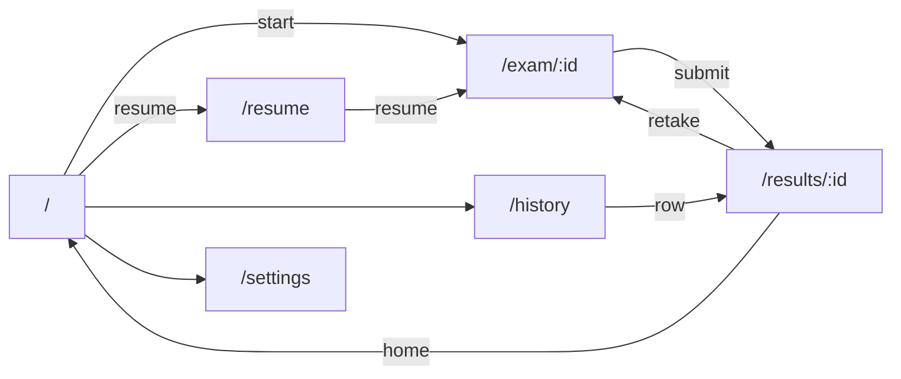

# CertPrep — Frontend Architecture

> The React client: routing, state strategy, component hierarchy, the design system, and screen-by-screen composition. Pairs with [`03-api-specification.md`](03-api-specification.md) (the contract it consumes) and [`01-architecture.md`](01-architecture.md).
>
> ⚠️ **Refined for Next.js — see [`09` §9](09-nextjs-refinement.md).** Routing is **Next.js App Router** (file-based, `src/app/**/page.tsx`), not React Router; build/serve is `next dev`/`next build`+`next start`, not Vite. Interactive screens are Client Components (`"use client"`). **State strategy (React Query + Zustand), the component hierarchy (§4), the shared library (§5), and the design tokens (§6) are unchanged** — read "React Router route" as "App Router page" throughout.

---

## 1. Stack & Conventions

- **Next.js (App Router) + React + TypeScript.** *(was "React 18 + Vite"; see [`09` §9](09-nextjs-refinement.md).)*
- **Tailwind CSS** for styling (utility-first, design tokens in config).
- **Next.js App Router** for routing (file-based; `useRouter`/`useParams` from `next/navigation`). Radix UI for accessible `Dialog`/`Select`.
- **TanStack Query (React Query)** for all server state (fetch/cache/invalidate).
- **Zustand** (or `useReducer` + context) for the **ephemeral exam-session store** only.
- **A typed `apiClient`** wrapping `fetch`, throwing `ApiError`, with one function per endpoint.
- File/folder naming: `PascalCase.tsx` for components, `camelCase.ts` for hooks/lib, colocated `*.test.tsx`.

### State strategy — the key decision
Two distinct kinds of state, two tools:

| State kind | Examples | Tool | Why |
|---|---|---|---|
| **Server state** | exam-paths tree, sets list, history, stats, settings, results | React Query | Cache, dedupe, invalidate on mutation; declarative loading/error |
| **Ephemeral exam state** | current selection before autosave, timer ticking, navigator open, which option is hovered | Zustand store | Must feel instant — no network on the hot path; synced to server via debounced autosave |

> The exam screen is the only place with heavy local state. Everything else is "fetch → render → mutate → invalidate" with React Query. Don't reach for global state elsewhere.

---

## 2. Routing

```
/                      → HomeScreen        (domain selector + quick stats)
/exam/:sessionId       → ExamScreen        (the core loop)
/results/:sessionId    → ResultsScreen     (post-submit summary + detail)
/history               → HistoryScreen      (list + filters + stats)
/history/:sessionId    → ResultsScreen     (reused, "from history" mode)
/resume                → ResumeScreen       (paused/in-progress list)
/settings              → SettingsScreen
*                      → NotFound
```

- `ExamScreen` is guarded: it loads the session; if `status !== in_progress` it redirects to `/results/:id`.
- A **navigation guard** warns before leaving an in-progress exam without pausing (autosave makes it safe, but the prompt prevents accidental loss of place/context).
- `last_selected_path` (settings) rehydrates the Home selector on return.



---

## 3. App Shell (F1)

```
<App>
 ├─ <QueryClientProvider>
 ├─ <ThemeProvider>            // theme setting → data-theme attr
 ├─ <ToastProvider>           // global notifications
 ├─ <ErrorBoundary>
 └─ <AppLayout>
     ├─ <MenuBar>             // Home · Resume (badge) · History · Settings
     ├─ <main><Outlet/></main>
     └─ <GlobalDialogs/>      // confirm-discard, exhausted-prompt, etc.
```

- **MenuBar** items: **Home**, **Resume** (shows a badge with the count of in-progress sessions, polled via React Query), **History**, **Settings**. Persistent across routes.
- **Persistent app state** (last path, theme) is server-backed via `/api/settings`, so it survives refresh — satisfying F1's "persistent app state via SQLite."

---

## 4. Component Hierarchy by Screen

### 4.1 HomeScreen (F2 + quick stats)
```
<HomeScreen>
 ├─ <QuickStatsWidget/>            // short-term: last score, streak, next set
 └─ <DomainSelector>              // cascading dropdowns from /api/exam-paths
     ├─ <CascadingDropdown level=0 />   // renders node.label + child titles
     ├─ <CascadingDropdown level=1 />   // appears only after level 0 chosen
     ├─ ... (n levels, any depth)
     ├─ <LeafSummary/>            // "3 sets · 2 remaining" + domain icon
     └─ <StartExamButton/>        // enabled only at a leaf with remaining sets
```
- Each `<CascadingDropdown>` is driven entirely by JSON: it shows the **current node's `label`** as the prompt and the **children's `title`** as options. Selecting a child either reveals the next dropdown or, at a leaf, enables Start.
- `<DomainIcon icon={node.icon}/>` maps the optional `icon` string to a component (plan §5).
- Start → `POST /api/sessions` → navigate to `/exam/:id`. If `409 SETS_EXHAUSTED`, open the reset-progress dialog.

### 4.2 ExamScreen (F4 — the core loop)
```
<ExamScreen>
 ├─ <ExamHeader>
 │   ├─ <ProgressBar/>            // question index, % answered, flagged count
 │   ├─ <ExamTimer/>             // counts down/up; pausing pauses it
 │   └─ <PauseButton/> <GiveUpButton/>
 ├─ <QuestionPanel>
 │   ├─ <QuestionText/>
 │   ├─ <OptionList>             // single → radio; multi → checkbox (future)
 │   │   └─ <OptionItem/>×n      // selectable; post-reveal shows correctness
 │   ├─ <RevealedDetail/>        // shown after give-up/submit: per-option explanations + Tips
 │   // (per ADR-13, single and multi render identically as a checkbox group)
 ├─ <NavigatorBar>
 │   ├─ <PrevButton/> <FlagButton/> <SubmitOrNextButton/>
 │   └─ <QuestionNavigator/>     // numbered buttons, colour-coded by state
 └─ <SubmitExamDialog/>          // confirm finish; shows unanswered/flagged counts
```
- Reads/writes the **Zustand exam store**; the store debounces `PATCH /api/sessions/:id` (autosave).
- `<QuestionNavigator>` colour legend (drives the design tokens): **answered**, **flagged**, **revealed**, **current**, **unanswered**.
- **Progressive reveal** (plan §5): after submit/reveal, show correct/incorrect first; `<RevealedDetail>` is collapsed behind a "Show explanations" expander when `progressive_reveal` is on.
- **Pause**: flush autosave, then navigate away — the session stays `in_progress` and appears under Resume.

### 4.3 ResultsScreen (F5, reused for history detail F7)
```
<ResultsScreen mode="post-exam | from-history">
 ├─ <ScoreSummaryCard/>          // %, correct/incorrect/revealed/unanswered, time
 ├─ <ResultsActions/>            // bookmark, add/edit note, retake (all/incorrect), home
 ├─ <DetailFilterBar/>           // all | incorrect only | revealed only | flagged
 └─ <QuestionReviewList>
     └─ <QuestionReviewCard/>×n  // your answer, correct answer, all explanations, Tips
```
- `<RetakeMenu>`: "Retake all" / "Retake incorrect only" → `POST /sessions/:id/retake` → `/exam/:newId`.
- Same component serves post-exam and history detail; `mode` only tweaks the header/back affordance.

### 4.4 ResumeScreen (F6)
```
<ResumeScreen>
 └─ <PausedExamList>
     └─ <PausedExamRow/>×n       // domain path, % answered, elapsed, paused date
         ├─ <ResumeButton/>      // → /exam/:id
         └─ <DiscardButton/>     // confirm → DELETE /sessions/:id
```
- Empty state when no in-progress sessions. Feeds the MenuBar "Resume" badge count.

### 4.5 HistoryScreen (F7)
```
<HistoryScreen>
 ├─ <AggregateStatsBar/>         // total, average, best, streak (from /api/stats)
 ├─ <HistoryFilterBar/>          // domain, cert, difficulty, score range, date range, bookmarked
 └─ <HistoryTable>
     └─ <HistoryRow/>×n          // date, domain, cert, difficulty, score, time
         ├─ inline <NoteEditor/> <BookmarkToggle/>
         └─ expand → summary + View details + Retake
```
- Filters map 1:1 to `GET /api/history` query params; changing a filter re-queries (React Query keyed by filter object).

### 4.6 SettingsScreen (F8)
```
<SettingsScreen>
 ├─ <SourceSettings/>            // Exams root path | upload mode + drag-drop + rescan
 ├─ <ExamDefaultsSettings/>      // timer on/off + minutes, show count, shuffle, progressive reveal
 ├─ <DataManagement/>            // export (JSON/CSV), reset progress per path, full/factory reset
 ├─ <CatalogDiagnostics/>        // invalid/warning files report
 └─ <Appearance/>                // theme
```

---

## 5. Shared Component Library (`client/src/components`)

Built once in F1, reused everywhere:

| Component | Notes |
|---|---|
| `Button`, `IconButton` | variants: primary/secondary/ghost/danger |
| `Dropdown`/`Select` | accessible, keyboard-navigable (drives the cascading selector) |
| `Card`, `Panel` | surfaces |
| `ProgressBar` | exam progress + generic |
| `Badge` | counts (Resume), status chips (difficulty, outcome) |
| `Dialog`/`Modal` | confirm flows (discard, submit, reset) |
| `Toast` | transient notifications |
| `Spinner`/`Skeleton` | loading states |
| `EmptyState` | no data placeholders |
| `Tabs`, `FilterBar` primitives | history/results filters |
| `Tooltip` | shortcut hints, drift badges |
| `DomainIcon` | maps `icon` id → svg |

All components are typed, themeable via tokens, and keyboard-accessible.

---

## 6. Design System & Tokens

Tailwind config defines semantic tokens so screens never hardcode raw colours.

```ts
// tailwind.config.ts (sketch)
theme: {
  extend: {
    colors: {
      bg:    'rgb(var(--bg) / <alpha-value>)',
      fg:    'rgb(var(--fg) / <alpha-value>)',
      muted: 'rgb(var(--muted) / <alpha-value>)',
      brand: 'rgb(var(--brand) / <alpha-value>)',
      // exam navigator / outcome semantics:
      correct:   'rgb(var(--correct) / <alpha-value>)',   // green
      incorrect: 'rgb(var(--incorrect) / <alpha-value>)', // red
      revealed:  'rgb(var(--revealed) / <alpha-value>)',  // amber
      flagged:   'rgb(var(--flagged) / <alpha-value>)',   // purple/orange
      current:   'rgb(var(--current) / <alpha-value>)',
    },
    borderRadius: { card: '0.75rem' },
  }
}
```
- **Theme via CSS variables** on `:root` and `[data-theme="dark"]`; `ThemeProvider` sets `data-theme` from the `theme` setting (`system` follows `prefers-color-scheme`).
- **Outcome/navigator colours are first-class tokens** because they carry meaning (correct/incorrect/revealed/flagged) and must stay consistent between the navigator, option list, and results.
- **Domain colours/icons** differentiate Cloud/DevOps/SWE/Interview (plan §5) — defined as a small token map keyed by `icon`.
- Type scale, spacing, and radii standardised so the exam screen stays calm and readable (principle: "the study loop is sacred").

---

## 7. Data Fetching Patterns (React Query)

- **Query keys** centralised in `lib/queryKeys.ts`: `['examPaths']`, `['sets', quesPath]`, `['session', id]`, `['history', filters]`, `['stats', filters]`, `['settings']`, `['inProgressCount']`.
- **Mutations invalidate** the right keys: submitting an exam invalidates `['history']`, `['stats']`, `['sets', quesPath]`, `['inProgressCount']`; discarding invalidates `['inProgressCount']` and `['sessions','in_progress']`.
- **The live exam session is NOT polled.** It's fetched once on mount into the Zustand store; thereafter the store is authoritative and pushes autosave PATCHes. On reconnect/refresh, refetch and rehydrate.
- **Optimistic UI** for cheap toggles (bookmark, note, flag) with rollback on error.

---

## 8. The Exam Store (Zustand) — shape

```ts
interface ExamStore {
  sessionId: string;
  questions: ExamQuestion[];   // from live DTO (no correct answers until revealed)
  currentIndex: number;
  answers: Record<number, AnswerState>;  // keyed by question.id
  timer: { enabled: boolean; limitMs?: number; elapsedMs: number; running: boolean };
  // actions
  select(qid: number, option: string): void;     // toggles for multi
  toggleFlag(qid: number): void;
  reveal(qid: number): void;                      // give up (no selection) or submit (with selection) — irreversible
  goTo(index: number): void;
  tick(deltaMs: number): void;                    // timer
  pause(): Promise<void>;                         // flush autosave
  // internal: debounced flush → PATCH /api/sessions/:id
}
```
- The store owns the **debounced autosave**: every mutating action schedules a flush; `pause()`, route-leave, and submit force an immediate flush.
- `reveal()` triggers an immediate (non-debounced) PATCH so the server attaches and returns the correct answer + explanations for that question.

---

## 9. Accessibility & Keyboard (short-term roadmap, designed-in now)

- Semantic HTML, focus management on route change, visible focus rings.
- Options are real radio/checkbox groups (arrow-key navigable).
- **Keyboard shortcuts** (short-term): `1–4`/`A–D` select, `Enter` submit/next, `N`/`P` navigate, `F` flag, `G` give up. Implemented via a `useKeyboardShortcuts` hook scoped to the exam screen, with a discoverable "?" cheat-sheet. Designed in now (store actions already map cleanly to keys), shipped per the roadmap.

---

## 10. Build & Serve

- **Dev:** `vite` (`:5173`, HMR) + Express (`:3000`), `/api` proxied. `npm run dev` runs both concurrently.
- **Prod:** `vite build` → `client/dist`; Express serves it with SPA fallback at `:3000`.
- No code-splitting needed for MVP scale, but routes are lazy-importable if the bundle grows.

---

## 11. Mapping to Feature Files

| Screen / area | Feature doc |
|---|---|
| App shell, MenuBar, theme, layout | [`features/F1-app-shell-navigation.md`](features/F1-app-shell-navigation.md) |
| DomainSelector, cascading dropdowns | [`features/F2-domain-selector.md`](features/F2-domain-selector.md) |
| Set listing/upload UI hooks | [`features/F3-question-set-loader.md`](features/F3-question-set-loader.md) |
| ExamScreen & store | [`features/F4-exam-engine.md`](features/F4-exam-engine.md) |
| ResultsScreen | [`features/F5-results-screen.md`](features/F5-results-screen.md) |
| ResumeScreen | [`features/F6-paused-exams.md`](features/F6-paused-exams.md) |
| HistoryScreen | [`features/F7-history.md`](features/F7-history.md) |
| SettingsScreen | [`features/F8-settings.md`](features/F8-settings.md) |
