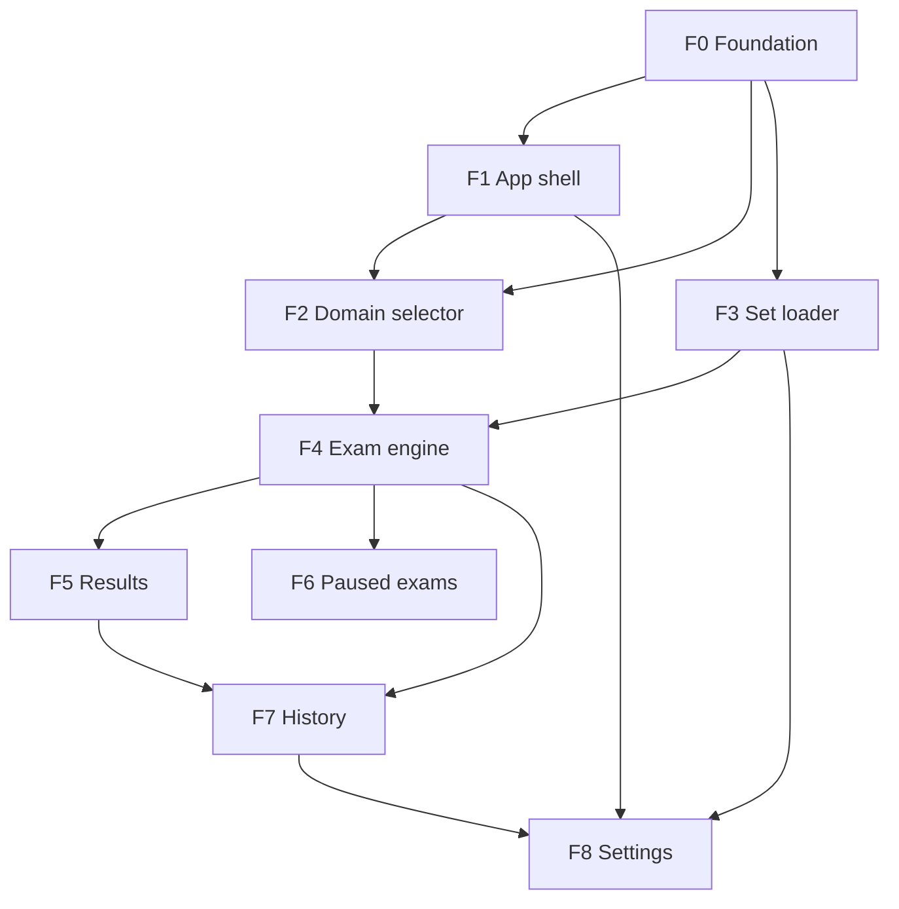

# CertPrep — Feature Roadmap & Build Order

> The MVP feature set, how features depend on each other, the recommended build sequence, and where the product plan's §5 enhancements land. Each feature has its own detailed task breakdown in [`features/`](features/).
>
> **Build cadence for this implementation:** F0 lands on `main` first; then **F1 ∥ F2 ∥ F3 run in parallel** (separate `Features/` worktrees, one agent each, merged back to main); then F4 (needs F2+F3), F5, F6 ∥ F7, F8. The dependency graph below governs ordering. Feature tasks are unchanged by the Next.js pivot except the mechanical substitutions in [`09` §11](09-nextjs-refinement.md).

---

## 1. Feature Inventory (MVP)

| ID | Feature | One-liner | Detailed tasks |
|---|---|---|---|
| **F0** | Foundation & setup | Scaffold, tooling, DB bootstrap, migrations, base server + client, design tokens | [F0](features/F0-foundation-setup.md) |
| **F1** | App shell & navigation | Layout, MenuBar, routing, theme, persistent state | [F1](features/F1-app-shell-navigation.md) |
| **F2** | Domain selector | Cascading dropdowns from `exam-paths.json` | [F2](features/F2-domain-selector.md) |
| **F3** | Question set loader | Scan/validate/catalogue sets; track completion; uploads | [F3](features/F3-question-set-loader.md) |
| **F4** | Exam engine | The core loop: deliver, answer, flag, reveal, pause, autosave | [F4](features/F4-exam-engine.md) |
| **F5** | Results screen | Summary + detailed, filterable, fully-explained review; retake | [F5](features/F5-results-screen.md) |
| **F6** | Paused exams | List, resume, discard in-progress sessions | [F6](features/F6-paused-exams.md) |
| **F7** | History | Filterable history, notes/bookmarks, aggregate stats | [F7](features/F7-history.md) |
| **F8** | Settings | Source config, exam defaults, data management, export | [F8](features/F8-settings.md) |

---

## 2. Dependency Graph

**Hard dependencies**
- Everything depends on **F0** (nothing runs without scaffold + DB + migrations).
- **F4** needs both **F2** (to pick a path) and **F3** (to load a set) — it's the integration point.
- **F5** needs **F4** (a completed session to show).
- **F6** needs **F4** (in-progress sessions to list).
- **F7** needs **F4/F5** (completed sessions + the results view it reuses).
- **F8** touches **F3** (source/rescan), **F4** (defaults), **F7** (export/reset) — built last so those exist to configure.

**Soft / parallelizable**
- F2 and F3 can be built in parallel after F0 (different surfaces: F2 is selector UI + path resolver; F3 is catalogue + scan).
- F1 can proceed alongside F2/F3 (shell + tokens), only needing F0.

---

## 3. Recommended Build Sequence (phases / milestones)

### Milestone M0 — "It boots" (F0)
Scaffold runs, `npm start` serves an empty shell at `:3000`, DB is created and migrated, `/api/health` responds. **Exit:** the skeleton is real and CI is green.

### Milestone M1 — "Pick an exam" (F1 + F2 + F3)
App shell with navigation; the domain tree renders from `exam-paths.json`; the catalogue scans and lists sets per path with completion state. **Exit:** a user can navigate to a leaf and see "3 sets · 2 remaining" with a (not-yet-functional) Start button.

### Milestone M2 — "Take an exam end-to-end" (F4 + F5)
The core loop works: start → answer/flag/reveal/navigate → pause/resume → submit → results with full explanations and retake. This is the **product's heart**; treat it as the primary risk and spend accordingly. **Exit:** Success Criteria 2–6 from [`00-product-overview.md`](00-product-overview.md) pass.

### Milestone M3 — "Track and manage" (F6 + F7 + F8)
Paused list, history with filters + stats, and settings/data-management round out the MVP. **Exit:** all eight Success Criteria pass; MVP shippable.

```mermaid
gantt
    title CertPrep MVP build order (relative, not calendar)
    dateFormat X
    axisFormat %s
    section M0
    F0 Foundation        :f0, 0, 3
    section M1
    F1 App shell         :f1, after f0, 2
    F2 Domain selector   :f2, after f0, 2
    F3 Set loader        :f3, after f0, 3
    section M2
    F4 Exam engine       :f4, after f2 f3, 5
    F5 Results           :f5, after f4, 3
    section M3
    F6 Paused exams      :f6, after f4, 2
    F7 History           :f7, after f5, 3
    F8 Settings          :f8, after f7, 2
```

---

## 4. Where the Plan §5 Enhancements Land

The product plan lists five recommended additions. They are **part of the MVP**, folded into the most relevant feature so they ship with it rather than as a bolt-on:

| §5 Enhancement | Folded into | Notes |
|---|---|---|
| **Timed mode toggle** (countdown; pause pauses timer) | **F4** (engine + `<ExamTimer>`) + **F8** (default) | `timer_enabled`, `timer_limit_ms` on the session; pause stops the tick. |
| **Retake incorrects only** | **F5** (action) + **F7** (from history) | `POST /sessions/:id/retake { scope: "incorrect" }`; new snapshot = incorrect+revealed subset. |
| **Progressive explanation reveal** | **F4/F5** | Show correct/incorrect first; explanations behind a "Show explanations" expander; `progressive_reveal` setting. |
| **Shuffle questions setting** | **F4** (seeded shuffle in snapshot) + **F8** (default) | `shuffle_questions` (and `shuffle_options`); seed stored on session for reproducibility. |
| **Domain icons** | **F2** (selector) | Optional `icon` on `exam-paths.json` nodes → `<DomainIcon>`. |

These are called out explicitly in each feature's task list so they aren't dropped.

---

## 5. Cross-Feature Foundations (build in F0, used everywhere)

To avoid rework, F0 establishes shared primitives the later features assume:
- **Shared zod schemas + TS types** (question set, exam-paths, API payloads) — see [`02-data-model.md`](02-data-model.md).
- **`apiClient`** with typed methods and `ApiError` — see [`04-frontend-architecture.md`](04-frontend-architecture.md).
- **Error middleware + `AppError`**, request validation middleware.
- **Migration runner** + `0001_init.sql`.
- **Design tokens + base component library** (Button, Dialog, Toast, etc.).
- **Test harness** (server + client) — see [`06-testing-strategy.md`](06-testing-strategy.md).

---

## 6. Definition of Done (per feature) — template

Every feature file ends with a DoD using this checklist shape:
- [ ] All tasks complete and merged.
- [ ] Acceptance criteria demonstrably pass (manual walkthrough recorded in the feature file).
- [ ] Unit tests for logic; integration tests for new endpoints; component tests for key UI.
- [ ] No new server route bypasses validation or the error envelope.
- [ ] Docs updated if the contract changed (data model / API spec).
- [ ] `CLAUDE.md` updated if repo structure/exam paths/question format changed.

---

## 7. Out of MVP (tracked separately)

Short/medium/long-term items live in [`07-post-mvp-roadmap.md`](07-post-mvp-roadmap.md). The schema and architecture are forward-designed (see the "forward-designed tables" in [`02-data-model.md` §3.2](02-data-model.md)) so these land without painful migrations:
- Short: keyboard shortcuts, confidence rating (column already present), single-result PDF export, home quick-stats.
- Medium: spaced repetition, multi-select questions, interview/freetext mode, question-linked notes, tags, progress dashboard.
- Long: question editor UI, AI "explain differently", sync/backup, multi-profile, community sets, ordered-steps questions.
