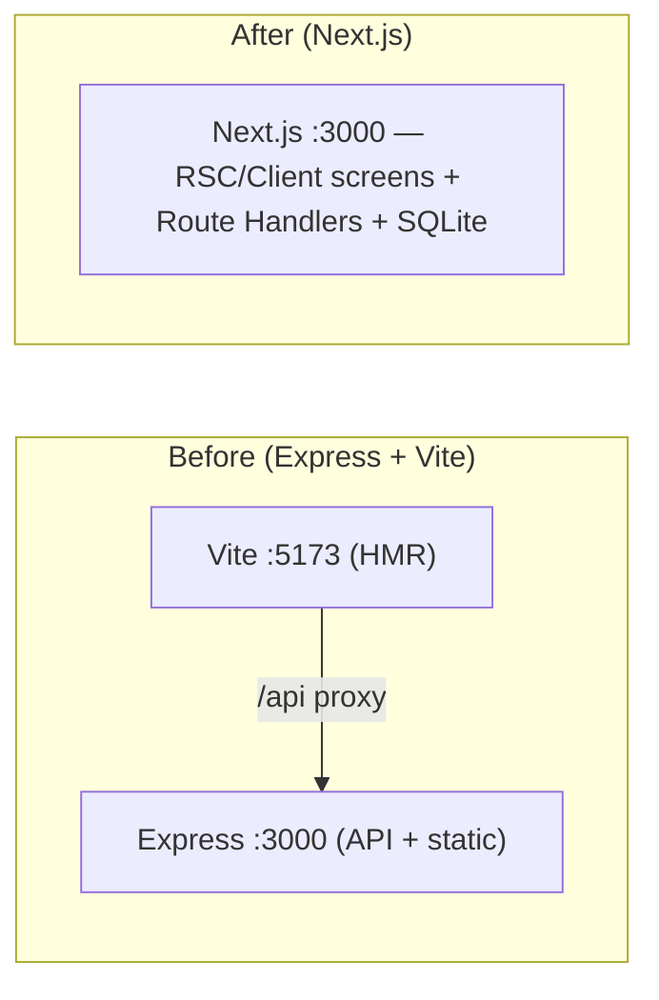

# CertPrep — Next.js Refinement (authoritative delta)

> **Status:** Accepted · supersedes the Express/Vite parts of `01`, `03`, `04`, and `F0`.
> **Read after `00`–`02`, before writing code.** Where this doc and an older doc disagree, **this doc wins** and the older doc's HTTP/DB *contracts* (endpoints, payloads, schema) still hold — only the *runtime/plumbing* changes.

This records the one structural refinement requested on top of the (already mature) plan: build the app as a **single Next.js (App Router) application** instead of a two-package Express API + Vite SPA. It also promotes the high-confidence fixes from [`08-analysis-review.md`](08-analysis-review.md) from "findings" to **decisions**, since we are implementing now.

---

## 1. The pivot, in one paragraph

The original design ran **two** processes in dev (Vite `:5173` + Express `:3000`) and one Express process in prod serving a built SPA. We collapse that into **one Next.js app**: React Server/Client Components render the screens, **Route Handlers** (`src/app/api/**/route.ts`) expose the *exact same REST contract* from [`03-api-specification.md`](03-api-specification.md), and `better-sqlite3` runs in Next's Node.js server runtime. `next dev` and `next start` both bind `:3000`, so the plan's promise — *"just `npm start`, open `localhost:3000`"* — is preserved with **less** moving machinery (no proxy, no concurrent processes, no separate static server).

**What does NOT change:** the four-layer model, the service decomposition, the SQLite schema, the snapshot-into-session integrity decision (ADR‑4), the answers-hidden DTO, the React Query + Zustand client strategy, and every endpoint's payload/semantics. Those are the load-bearing decisions and they all survive intact.



---

## 2. Data-access architecture (decided)

**Route Handlers + React Query.** The client keeps a typed `apiClient` over `fetch('/api/..')` and TanStack Query for caching/invalidation; the exam hot path keeps its Zustand store + debounced autosave `PATCH`. Server Actions/RSC-direct-DB were considered and rejected for the *data* path because (a) the 300–500 ms debounced autosave loop and the answers-hidden contract are cleaner over a typed fetch endpoint, (b) it preserves [`03`](03-api-specification.md) verbatim and keeps HTTP-level integration tests meaningful, and (c) it keeps one mental model. RSC is still used for what it's good at: thin page shells and static layout. See ADR‑9.

---

## 3. The four layers → Next.js

The dependency rule (`Presentation → API → Logic → Data`, downward only) is unchanged. Only the *hosting* of each layer moves:

| Layer | Was | Now (Next.js) | Notes |
|---|---|---|---|
| **Presentation** | Vite React SPA + React Router | `src/app/**/page.tsx` (App Router). Interactive screens are **Client Components** (`"use client"`) wrapping the same component tree. | Routing is file-based; navigation via `next/navigation`. |
| **API** | Express routers + `validate()`/`errorHandler()` middleware | `src/app/api/**/route.ts` **Route Handlers** + a tiny `defineHandler()` wrapper that does zod parsing and `AppError → envelope` mapping. | Same paths, same JSON, same status codes. |
| **Logic** | `server/src/services/*` | `src/server/services/*` (unchanged code) | Pure/near-pure; no HTTP, no SQL strings. `ScoreCalculator` stays pure. |
| **Data** | `server/src/data/*` (better-sqlite3, repos, migrations, fileReader) | `src/server/data/*` (unchanged code) | One DB singleton; repos own all SQL. |

The API layer is now ~30 lines of `route.ts` per resource instead of an Express router, but it calls the **same** services. A route handler must still never touch SQL or `fs` directly — it parses input, calls a service, maps the result/error.

---

## 4. Project structure (replaces `01` §6)

Single package, `src/` dir, `@/*` → `src/*`.

```
exam-engine/                  (Main worktree, branch: main)
├── package.json              # scripts: dev, build, start, test, test:e2e, lint, typecheck
├── next.config.ts            # serverExternalPackages: ['better-sqlite3']
├── tsconfig.json             # paths: { "@/*": ["./src/*"] }
├── tailwind.config.ts        # semantic tokens (04 §6)
├── postcss.config.mjs
├── vitest.config.ts          # unit + integration (node env for server, jsdom for client)
├── playwright.config.ts      # one E2E spine
├── instrumentation.ts        # register(): runMigrations() + bootScan() — nodejs runtime only
├── .env.example              # PORT, DB_PATH, EXAMS_ROOT, EXAM_PATHS_FILE, LOG_LEVEL
├── exam-paths.json           # EXISTING — navigation source of truth (add "version": 1)
├── Exams/                    # EXISTING — question JSON sets
├── data/                     # gitignored — certprep.db (+ -wal/-shm), uploads/
├── docs/                     # these planning docs
└── src/
    ├── app/                              # Presentation + API
    │   ├── layout.tsx                    # <html>, providers, MenuBar, no-FOUC theme script
    │   ├── globals.css                   # tailwind layers + CSS-var tokens (:root / [data-theme=dark])
    │   ├── page.tsx                      # Home (F2 selector + quick-stats slot)
    │   ├── exam/[id]/page.tsx            # ExamScreen (client)
    │   ├── results/[id]/page.tsx         # ResultsScreen (client)
    │   ├── history/page.tsx              # HistoryScreen (client)
    │   ├── history/[id]/page.tsx         # ResultsScreen reused (from-history mode)
    │   ├── resume/page.tsx               # ResumeScreen (client)
    │   ├── settings/page.tsx             # SettingsScreen (client)
    │   ├── not-found.tsx
    │   └── api/                          # API layer — Route Handlers (see §6 for the map)
    │       └── …/route.ts
    ├── server/                           # Logic + Data (import 'server-only')
    │   ├── config.ts                     # env + defaults, resolved once
    │   ├── container.ts                  # composition root: resolved config + wired repos→services
    │   ├── boot.ts                       # runMigrations(); bootScan(); integrityCheck()
    │   ├── http/
    │   │   ├── errors.ts                 # AppError(code,message,httpStatus,details?) + ERROR_CODES
    │   │   ├── defineHandler.ts          # wrapper: parse(zod) → service → json | envelope
    │   │   └── respond.ts                # json(), created(), noContent(), envelope()
    │   ├── services/                     # pathResolver, setCatalog, examEngine, sessionManager,
    │   │   │                             #   scoreCalculator (pure), statsService, exportService
    │   ├── data/
    │   │   ├── db.ts                      # singleton (globalThis guard), WAL + foreign_keys per-conn
    │   │   ├── migrate.ts                 # numbered SQL, schema_migrations, txn, idempotent
    │   │   ├── migrations/0001_init.sql
    │   │   ├── fileReader.ts              # scan + parse + sha256 hash
    │   │   └── repos/                     # settingsRepo, setCatalogRepo, sessionRepo, answerRepo,
    │   │                                  #   completionRepo, (notesRepo later)
    │   └── test/                          # makeTestDb(), seedSession(), fixtures/
    ├── domain/
    │   ├── schemas.ts                     # zod: question set, exam-paths, API payloads, DTOs
    │   └── types.ts                       # z.infer<> types (imported by client AND server)
    ├── lib/                               # client-safe
    │   ├── apiClient.ts                   # typed fetch over /api; throws ApiError
    │   ├── queryKeys.ts
    │   ├── providers.tsx                  # "use client" QueryClientProvider, Theme, Toast, ErrorBoundary
    │   └── formatters.ts
    ├── components/                        # shared primitives (Button, Dialog(Radix), Toast, …)
    ├── features/                          # F1–F8 feature components (mirror 04 §4)
    ├── hooks/                             # useExamSession, useTimer, useKeyboardShortcuts, useSettings
    └── store/                             # examStore.ts (zustand)
```

> **Server/client boundary:** anything under `src/server/**` and `src/domain/schemas.ts`'s server use must never be imported by a Client Component. Put `import 'server-only'` at the top of `db.ts`, `container.ts`, services, and repos so a stray client import fails the build loudly. Shared **types** (`src/domain/types.ts`) are type-only and safe to import anywhere.

---

## 5. better-sqlite3 ⨯ Next.js — the four things that bite (and the fixes)

These are the only genuinely Next-specific hazards. All are one-liners once known; F0 bakes them in.

1. **Native module bundling.** `better-sqlite3` is a native addon and must not be webpack/turbopack-bundled. → `next.config.ts`: `serverExternalPackages: ['better-sqlite3']`. (On Next < 15 the key is `experimental.serverComponentsExternalPackages`.)
2. **Edge runtime can't load native addons.** Every route handler / module that touches the DB runs in **Node.js** runtime (the default for route handlers — just never set `export const runtime = 'edge'`). Data routes also set `export const dynamic = 'force-dynamic'` so dynamic DB reads aren't statically cached.
3. **Dev HMR re-instantiates modules** → without a guard you leak DB connections and re-open the file every edit. → singleton stored on `globalThis`:
   ```ts
   // src/server/data/db.ts
   import 'server-only';
   import Database from 'better-sqlite3';
   const g = globalThis as unknown as { __certprepDb?: Database.Database };
   export function getDb() {
     if (!g.__certprepDb) {
       const db = new Database(config.dbPath);
       db.pragma('journal_mode = WAL');
       db.pragma('foreign_keys = ON');   // MUST be set on this connection (see §7.2)
       g.__certprepDb = db;
     }
     return g.__certprepDb;
   }
   ```
4. **No Express "before listen" hook for migrations.** → `instrumentation.ts`'s `register()` runs once on server boot:
   ```ts
   // instrumentation.ts (repo root)
   export async function register() {
     if (process.env.NEXT_RUNTIME === 'nodejs') {
       const { runMigrations, bootScan, integrityCheck } = await import('./src/server/boot');
       integrityCheck();   // PRAGMA integrity_check → friendly fatal if corrupt
       runMigrations();    // forward-only, transactional, idempotent
       bootScan();         // catalogue scan (F3); safe no-op until F3 lands
     }
   }
   ```
   A lazy `getDb()` guard also ensures migrations have run before first query (boot.ts is idempotent), so tests and edge cases that bypass `register()` are still safe.

---

## 6. Endpoint map → Route Handlers (with `08` renames applied)

The contract in [`03`](03-api-specification.md) is unchanged except the renames/additions below (all from `08-analysis-review.md` §5). One file per resource; `[param]` = dynamic segment.

| Method · Path | File | Notes / change |
|---|---|---|
| `GET /api/health` | `api/health/route.ts` | |
| `GET /api/exam-paths` | `api/exam-paths/route.ts` | |
| `POST /api/catalog/scan` | `api/catalog/scan/route.ts` | **renamed** from `/api/scan` |
| `GET /api/catalog/diagnostics` | `api/catalog/diagnostics/route.ts` | |
| `POST /api/catalog/upload` | `api/catalog/upload/route.ts` | **renamed** from `/api/sets/upload` (no longer collides with `:setId`) |
| `GET /api/sets` | `api/sets/route.ts` | query `quesPath` |
| `GET /api/sets/[setId]` | `api/sets/[setId]/route.ts` | response shape now specified (full set or `409` candidates) |
| `POST /api/sessions` · `GET /api/sessions` | `api/sessions/route.ts` | `GET` contract specified in §8 |
| `GET·PATCH·DELETE /api/sessions/[id]` | `api/sessions/[id]/route.ts` | autosave timer semantics in §7.1 |
| `POST /api/sessions/[id]/submit` | `api/sessions/[id]/submit/route.ts` | |
| `GET /api/sessions/[id]/results` | `api/sessions/[id]/results/route.ts` | |
| `PATCH /api/sessions/[id]/review` | `api/sessions/[id]/review/route.ts` | returns updated review fields |
| `POST /api/sessions/[id]/retake` | `api/sessions/[id]/retake/route.ts` | |
| `GET /api/history` | `api/history/route.ts` | |
| `GET /api/stats` | `api/stats/route.ts` | |
| `GET /api/settings` · `PATCH /api/settings` | `api/settings/route.ts` | **`PATCH`** (was `PUT`) — partial update |
| `POST /api/progress/reset` | `api/progress/reset/route.ts` | |
| `GET /api/export` | `api/export/route.ts` | validate **before** writing the stream (can't send a JSON error mid-body) |

**Canonical error codes** (add to the `03` list): `VALIDATION_ERROR`, `EXAM_PATHS_INVALID`, `PATH_NOT_FOUND`, `PATH_TRAVERSAL`, `SET_NOT_FOUND`, `SET_AMBIGUOUS`, `SETS_EXHAUSTED`, `SESSION_NOT_FOUND`, `SESSION_NOT_IN_PROGRESS`, `SESSION_ALREADY_COMPLETED`, `UNSUPPORTED_QUESTION_TYPE`, `UPLOAD_REJECTED`, `INTERNAL`.

`defineHandler` shape (keeps handlers DRY and the envelope consistent):
```ts
export const POST = defineHandler({
  body: CreateSessionBody,                      // zod; omit if none
  handler: async ({ body }) => {                // throws AppError on failure
    const session = await examEngine.createSession(body);
    return created(session);                     // → 201 + JSON
  },
});
// wrapper: parse query/body/params → call handler → AppError|ZodError ⇒ { error: {...} } with status
```

---

## 7. Resolved blocking/high items from `08` (now decisions)

### 7.1 Timer & resume model — **decided** (closes `08` §1.1)
- `exam_sessions.time_elapsed_ms` is the source of truth for elapsed time.
- The **client owns the tick** (it pauses when the exam is paused) and reports absolute elapsed in the autosave `PATCH` body as `elapsedMs`. **Semantics: replace (absolute), not add.** The server **clamps** to `[0, timer_limit_ms]` when timed and writes it. Replace-semantics makes the PATCH idempotent on retry (a duplicate delivers the same absolute value).
- **Threat model:** local single-user; trusting a clamped client elapsed is acceptable (no scoring depends on it beyond pass/fail timing). Documented as accepted.
- **Expiry:** when timed and `elapsedMs >= timer_limit_ms`, the server clamps and returns `timer.expired = true` in the DTO. The client auto-submits on expiry (default) — configurable later to "prompt." Auto-submit reuses `POST …/submit`.
- **Data-loss window on hard crash:** at most one debounce interval (~400 ms) plus one tick. Stated and accepted. The `beforeunload`/`sendBeacon` flush (7.3) shrinks the common case to ~0.
- **Resume:** `GET /api/sessions/[id]` returns `time_elapsed_ms`; the store rehydrates and continues ticking from there.

### 7.2 `PRAGMA foreign_keys` per connection — **decided** (closes `08` §4 top risk)
better-sqlite3 applies pragmas **per connection**. `foreign_keys = ON` is set inside `getDb()` every time a connection is opened (incl. `makeTestDb()`), or `ON DELETE CASCADE` silently no-ops. Covered by a repo test that deletes a session and asserts its answers are gone.

### 7.3 Autosave survives hard tab-close — **decided** (closes `08` §1.4)
The exam store registers a `beforeunload` handler that flushes pending state via `navigator.sendBeacon('/api/sessions/[id]', body)` (falls back to a `keepalive` fetch). `reveal()` and `pause()` already force an immediate (non-debounced) `PATCH`. A small spike in F1 validates the App-Router `useRouter`/route-change flush + `beforeunload` path before F4 leans on it.

### 7.4 Snapshot integrity regression test — **required in F4** (closes `08` §1.2)
Integration test: create session → mutate/delete the source JSON → submit → assert score and results detail come from the snapshot. Plus a shuffled-option-order → original-answer mapping test at grade time.

### 7.5 Path-traversal — **decided** (closes `08` §1.3, §3)
`PATH_TRAVERSAL` error code added. A single `resolveUnderRoot(root, candidate)` helper `path.resolve`s and asserts the result is within the sandbox root, used by PathResolver, the catalog upload target, and the Settings `exams_root` validator — and **`exams_root` is validated before being persisted**, not just when used. Test vectors: `../../etc/passwd`, URL-encoded `%2e%2e`, absolute paths, valid-relative-but-escapes-after-resolve, symlinks. Upload cap: **1 MB**, `.json` only.

### 7.6 Cheap correctness fixes folded into `0001_init.sql` / boot (closes `08` §3–4)
- `PRAGMA journal_mode = WAL` on boot.
- **CHECK constraints** on every enum column (`status`, `mode`, `difficulty`, catalog `status`/`source`) — a `'in-progress'` typo must be rejected, not silently stored.
- **Composite index** `set_completion(ques_path, set_id)` for repeat-avoidance; keep the single-column indexes the schema already lists.
- Boot-time `PRAGMA integrity_check` with a friendly fatal message.
- Migrations run **inside a transaction**; `schema_migrations` row written only on commit.
- Score fields NOT-NULL-when-completed and `timer_enabled ⇒ timer_limit_ms NOT NULL` enforced at the submit/create handlers (and a CHECK where expressible).

### 7.7 `zod` is the contract — **decided** (closes `08` §1.5)
All response DTO types are `z.infer<>` of schemas in `src/domain/schemas.ts` (no hand-declared interfaces). One contract test parses a known-good server response through the client schema; one test validates the **real** `exam-paths.json`.

### 7.8 Misc accepted now
- `PATCH /api/settings` (not `PUT`). `set_catalog` work split into `setCatalogRepo` (SQL) + `SetCatalogService` (orchestration). `exam-paths.json` gains `"version": 1` with an unknown-version fallback in PathResolver. `npm run validate` standalone JSON validator reusing the schemas. "Bookmark" = `exam_sessions.is_bookmarked` toggled via `PATCH …/review`; surfaced in History/Results.

---

## 8. `GET /api/sessions` — contract (was undocumented; closes `08` §5)

```
GET /api/sessions?status=in_progress|completed|discarded&limit&offset
```
**200** → `{ "items": SessionListRow[], "total": number }` where `SessionListRow` =
```jsonc
{ "id": "…", "status": "in_progress", "domainLabel": "Cloud / AWS / SAA / Easy",
  "setTitle": "…", "difficulty": "Easy", "percentAnswered": 40, "answeredCount": 4,
  "totalQuestions": 10, "timeElapsedMs": 252000, "pausedAt": "…",  // = updated_at
  "createdAt": "…" }
```
F1's Resume badge uses `?status=in_progress` and reads `total`. F6 renders `items`. One handler, two consumers — built in F1 (count) and completed in F6 (full rows); the DTO above is the single source of truth so it isn't built twice incompatibly.

---

## 9. Frontend deltas (replaces `04` §1, §2, §10)

- **Stack:** Next.js (App Router) + React + TypeScript + Tailwind + TanStack Query + Zustand + a typed `apiClient`. (React Router is **dropped**; routing is file-based via App Router. Radix UI provides accessible `Dialog`/`Select` per `08` §6.)
- **Routes** map 1:1 to the old table via App Router files (see §4). Route params via `useParams()`; navigation via `useRouter()` from `next/navigation`. The `*` route → `not-found.tsx`.
- **Providers** live in a single `"use client"` `providers.tsx` rendered by the root `layout.tsx` (QueryClient, Theme, Toast, ErrorBoundary). The exam screen, results, history, resume, settings are Client Components (`"use client"`); Home's shell is a Server Component with a client `<DomainSelector>` island.
- **No-FOUC theme:** an inline `<script>` in `layout.tsx` reads `localStorage.theme` (mirrored from the `theme` setting) and sets `data-theme` before paint. React Query rehydrates the authoritative value from `/api/settings`.
- **React Query guard:** the `['session', id]` key uses `staleTime: Infinity` + `refetchOnWindowFocus: false` during an active exam so a focus refetch can't stomp the Zustand store (`08` §6).
- **Build/serve:** `next dev` (HMR, `:3000`) for development; `next build` + `next start` (`:3000`) for "production"/normal use. No Vite, no proxy, no concurrent processes.

---

## 10. Testing deltas (amends `06`)

- **Unit (services, pure logic, repos):** Vitest, node environment, `:memory:`/temp-file SQLite via `makeTestDb()`. **Unchanged in spirit.** `ScoreCalculator` still gets the most tests.
- **API integration:** test Route Handlers by importing the handler and invoking it with a `Request` (no network), or with `next-test-api-route-handler`. Asserts the same contract (status, envelope, answers-hidden). Each test gets a fresh migrated temp DB; `foreign_keys` verified on.
- **Component:** Vitest + React Testing Library + jsdom; mock `apiClient`. Wrap components needing `next/navigation` with the appropriate test providers.
- **E2E:** Playwright boots `next start` against a seeded temp DB + fixture `Exams/` + `exam-paths.json`; one spine test (select → start → answer/flag/give-up → pause → resume → submit → results → retake-incorrect).

---

## 11. What carries over unchanged (so agents don't re-derive)

- **`00` product overview, `02` data model (schema), `05` roadmap (sequence), `07` post-MVP, `08` review (as the audit log):** still valid. `02`'s DDL gets only the §7.6 additions.
- **`F1`–`F8` feature files:** their **tasks, acceptance criteria, and DoD stand**. Mechanical substitutions when implementing: *"Express route"* → *"Route Handler (`route.ts`)"*; *"Vite/React Router"* → *"Next App Router"*; *"PUT /settings"* → *"PATCH /settings"*; *"POST /scan"/"/sets/upload"* → *"/api/catalog/scan"/"/api/catalog/upload"*. Where a feature names a path under `server/src/...`, read it as `src/server/...`. Everything else is literal.

---

## 12. New/updated ADRs (extend `01` §12)

| # | Decision | Why | Trade-off |
|---|---|---|---|
| **ADR‑9** | **Single Next.js app (App Router) replaces Express + Vite**; REST contract preserved as Route Handlers | One process, one port, no proxy; keeps the mature API/DB contracts and the React Query/Zustand client | Next-specific gotchas (§5); team must respect the server/client boundary |
| **ADR‑10** | **`better-sqlite3` in Next Node runtime** via `serverExternalPackages` + `globalThis` singleton + `instrumentation.ts` boot migrations | Synchronous, fast, simplest correct code for one local user; survives HMR | Native build per platform (Node 22 pinned); never edge |
| **ADR‑11** | **Timer = client tick + absolute-`elapsedMs` autosave, server-clamped (replace semantics)** | Idempotent autosave; instant UI; acceptable for local single user | Trusts a clamped client value; ~400 ms crash window |
| **ADR‑12** | **`instrumentation.register()` runs migrations + boot scan** (plus a lazy `getDb()` guard) | The Next-idiomatic single boot hook; idempotent and test-safe | Must guard to `NEXT_RUNTIME==='nodejs'` |
```
